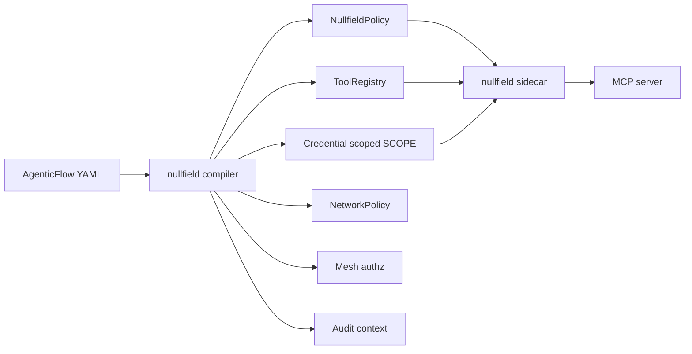
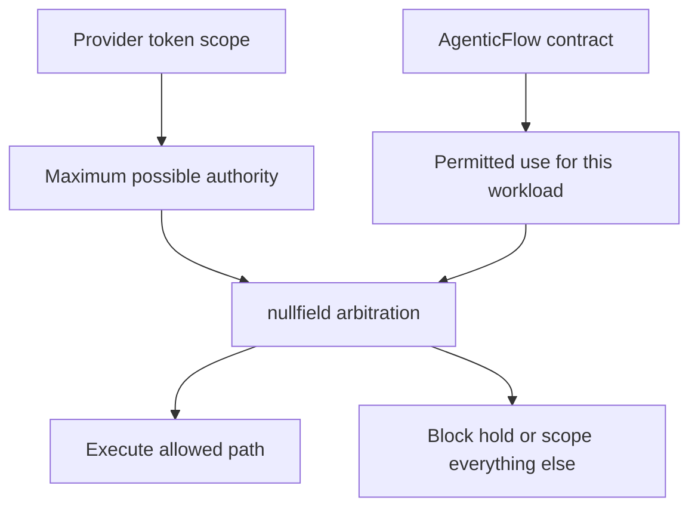
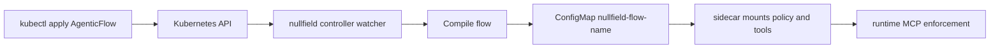

# Agentic Flows

`AgenticFlow` is a concise YAML intent format for defining the known acceptable path for an agentic workload. It compiles declared intent into the enforcement surfaces nullfield already uses.

The goal is not to replace `NullfieldPolicy`. The goal is to give teams a higher-level contract for tools, credentials, workload identity, network reachability, mesh authorization, and audit context, then compile that contract into deterministic PDP/PEP controls.



The practical effect: model behavior can remain non-deterministic, but executable authority is constrained to declared paths.

## Current Status

Implemented today:

- Local compiler: `go run ./cmd/nullfield-compile <flow.yaml>`
- Kubernetes CRD: `AgenticFlow`
- Controller reconciliation to `nullfield-flow-<name>` ConfigMaps
- Runtime policy and registry generation
- Credential-scoped `SCOPE` rules with OAuth audience/scope audit context
- Optional NetworkPolicy, Istio, Cilium, and Linkerd artifact generation
- Runtime demo proving CRD-generated policy can be mounted by a nullfield sidecar and enforce real MCP calls

Next build targets:

- Richer credential demos using Vault/K8s Secret/OAuth-style flows
- More lane-specific examples for human, delegated, machine, chain, and anonymous traffic

## Why This Exists

Provider scopes define what a token could do. `AgenticFlow` defines what this workload is allowed to do.



This distinction matters because prompt injection, tool output, tickets, documents, and agent-to-agent delegation can all influence which valid tool call an agent tries to make. The MCP server and upstream token may behave correctly while the larger workflow still makes the wrong call.

## Example

```yaml
apiVersion: nullfield.io/v1alpha1
kind: AgenticFlow
metadata:
  name: demo-jira
spec:
  lane: delegated
  transport: A
  selector:
    matchLabels:
      app: demo-agent
  network:
    egress:
      - name: atlassian
        cidr: 104.192.136.0/21
        ports: [443]
  generatedControls:
    mode: preview
  mesh:
    istio:
      principals:
        - cluster.local/ns/demo/sa/demo-runtime
      ports: [9090]
    cilium:
      ingress:
        - fromEndpoints:
            - app: demo-runtime
          port: 9090
          methods: [POST]
    linkerd:
      servers:
        - name: demo-mcp
          port: 9090
          identities:
            - demo-runtime.demo.serviceaccount.identity.linkerd.cluster.local
  credentials:
    - name: jira-read
      from: vault
      secretRef: jira-read-token
      injectAs: token
      oauth:
        audience: https://api.atlassian.com
        scopes: [read:jira-work]
  tools:
    - name: mcp-atlassian.read_issue
      action: ALLOW
      allowedScopes: [PROJECT-A, PROJECT-B, PROJECT-C]
      auditLabels:
        system: jira
        resource: issue

    - name: mcp-atlassian.search
      action: ALLOW
      credentialRefs: [jira-read]

    - name: mcp-atlassian.delete_page
      action: DENY
      reason: delete is outside the known acceptable path
```

Compile it:

```bash
go run ./cmd/nullfield-compile examples/agentic-flow.yaml > compiled.yaml
```

The output is a multi-document YAML stream:

- `NullfieldPolicy` with stable rule IDs, `requireIdentity: true`, runtime actions, credential-scoped `SCOPE` rules, audit labels, and a default deny.
- `ToolRegistry` containing every declared tool, including explicitly denied tools, so policy denials are visible as policy decisions instead of disappearing at the registry gate.
- `NetworkPolicy`, when `spec.network.egress` is declared.
- Istio `AuthorizationPolicy`, when `spec.mesh.istio` is declared.
- Cilium `CiliumNetworkPolicy`, when `spec.mesh.cilium` is declared.
- Linkerd `Server` and `ServerAuthorization`, when `spec.mesh.linkerd` is declared.

Credential declarations are resolved by name. If a tool references an undeclared credential, compilation fails. OAuth metadata is preserved as audit context so operators can see which audience and scopes were intended for the credentialed path.

## Generated Controls

Each generated artifact answers a different question:

| Artifact | Question |
|---|---|
| `ToolRegistry` | Is this tool part of the declared workload? |
| `NullfieldPolicy` | Is this exact tool action allowed, denied, held, scoped, or budgeted? |
| Credential-scoped `SCOPE` | May this credential attach to this exact tool action? |
| `NetworkPolicy` | Can this workload reach that destination at all? |
| Mesh authorization | Which workload identity can call this service or port? |
| Audit context | Which declared flow and rule caused this decision? |

These controls are layered because they narrow different dimensions of authority. None of them replaces the others.

Generated network and mesh artifacts default to `preview` mode. In preview mode they appear in `compiled.yaml` and in `AgenticFlow.status.generatedArtifacts`, but the controller does not apply them.

To apply selected generated controls, opt in explicitly:

```yaml
spec:
  generatedControls:
    mode: apply
    apply: [NetworkPolicy]
```

Apply mode is intentionally narrow:

- `mode` must be `preview` or `apply`
- `apply` is required when `mode: apply`
- only known generated kinds are accepted
- broad selectors, missing ports, missing principals, and missing identities fail compilation

Supported apply kinds today:

- `NetworkPolicy`
- `AuthorizationPolicy`
- `CiliumNetworkPolicy`
- `Server`
- `ServerAuthorization`

## Kubernetes Reconciliation

`AgenticFlow` is also available as a namespaced CRD. When the controller runs with `NULLFIELD_CRD_WATCH=true`, the CRD watcher lists `agenticflows.nullfield.io`, compiles each flow, and writes a managed ConfigMap named `nullfield-flow-<name>` containing:

- `compiled.yaml` — all generated artifacts
- `policy.yaml` — compiled `NullfieldPolicy`
- `tools.yaml` — compiled `ToolRegistry`

The watcher also patches `status` with:

- `conditions[type=Compiled]` — `True` or `False`
- `conditions[type=GeneratedControlsPreviewed]` or `conditions[type=GeneratedControlsApplied]`
- `observedGeneration`
- `artifactHash`
- `generatedArtifacts`
- `configMapName`
- `lastReconciledAt`

Apply the CRD and an example:

```bash
kubectl apply -f deploy/crds/agenticflow-crd.yaml
kubectl apply -f examples/crd/agentic-flow-example.yaml
```



## Portable Demos

Two demos are kept intentionally generic:

- [Demo 13](../demos/13-agentic-flow-local/) compiles a local flow and checks generated ALLOW, SCOPE, HOLD, DENY, and default-deny rules.
- [Demo 14](../demos/14-agentic-flow-kubernetes/) applies an `AgenticFlow` CRD, waits for controller reconciliation, deploys an echo MCP server with a nullfield sidecar, and proves real MCP ALLOW, policy DENY, and registry DENY behavior.

## Control Split

Use `AgenticFlow` for runtime MCP intent: which agent path may call which tool, under which identity, with which credential and audit labels.

Network and mesh policy generation is opt-in. `NetworkPolicy`, Istio `AuthorizationPolicy`, Cilium policy, and Linkerd policy answer different questions, so nullfield only emits these artifacts when the flow declares enough explicit workload, destination, principal, port, and method intent to avoid broad allow rules.
